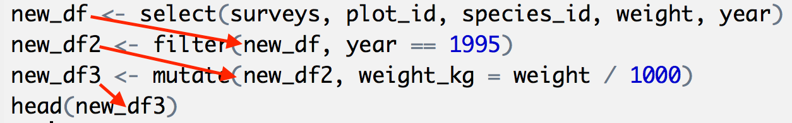
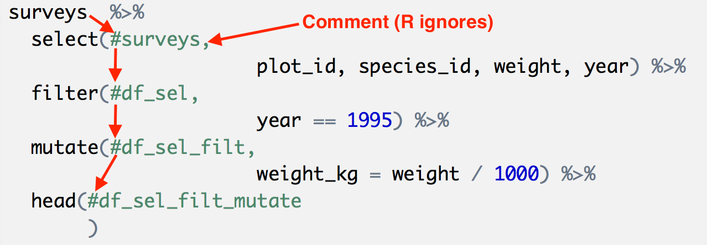

Introduction to R
========================================================
author: 
date: 
autosize: true

Why use R?
========================================================

- Save and rerun code
- Lots of stats/data science packages
- Great graphics
- Built for data
- free, open source, cross-platform
- Large community

Market-share
========================================================


Why RStudio?
========================================================

- Adds *quality of life* improvements
  - Code completion
  - Variable explorer
  - Keyboard shortcuts
- Adds more advanced file-types
  - Rmarkdown
  - Rpresentation
  
More about RStudio
========================================================


  
Interacting with R
========================================================

- **Ctrl/Cmd + Enter** to run code
- **Ctrl + 1** and **Ctrl + 2** switches between script and console

Getting Help
========================================================


```r
?barplot
args(lm)
```

```
function (formula, data, subset, weights, na.action, method = "qr", 
    model = TRUE, x = FALSE, y = FALSE, qr = TRUE, singular.ok = TRUE, 
    contrasts = NULL, offset, ...) 
NULL
```

```r
??kruskal
```

Evaluating Expression in the Console
========================================================


```r
3 + 5
```

```
[1] 8
```

```r
12 / 7
```

```
[1] 1.714286
```

Saving and Retrieving a Value
========================================================


```r
weight_kg <- 55
weight_kg
```

```
[1] 55
```

Using Variables in Expressions
========================================================


```r
# A variable in an expression
2.2 * weight_kg
```

```
[1] 121
```

```r
# The value didn't change
weight_kg
```

```
[1] 55
```

Using Variables in Expressions
========================================================

```r
# Changing the value
weight_kg <- 57.5
2.2 * weight_kg
```

```
[1] 126.5
```

```r
# Creating a new variable
weight_lb <- 2.2 * weight_kg
weight_lb
```

```
[1] 126.5
```

Challenge
========================================================

What are the values after each statement in the following?

```r
mass <- 47.5            # mass?
age  <- 122             # age?
mass <- mass * 2.0      # mass?
age  <- age - 20        # age?
mass_index <- mass/age  # mass_index?
```

Calling functions
========================================================


```r
a <- 2
b <- sqrt(a)
b
```

```
[1] 1.414214
```

```r
round(3.14159)
```

```
[1] 3
```

More on calling functions
========================================================


```r
# Changing a default value
args(round)
```

```
function (x, digits = 0) 
NULL
```

```r
round(3.14159, digits = 2)
```

```
[1] 3.14
```

More ways to provide arguments
========================================================

```r
args(round)
```

```
function (x, digits = 0) 
NULL
```

```r
# Pass arguments by position
round(3.14159, 2)
```

```
[1] 3.14
```

```r
# Pass arguments using name = value (order doesn't matter)
round(digits = 2, x = 3.14159)
```

```
[1] 3.14
```

Vectors
========================================================

- Used to store an ordered sequence
- 6 basic types
  - character
  - numeric
  - logical
  - integer
  - complex
  - raw
  
Vector Examples
========================================================


```r
weight_g <- c(50, 60, 65, 82)
weight_g
```

```
[1] 50 60 65 82
```

```r
animals <- c("mouse", "rat", "dog")
animals
```

```
[1] "mouse" "rat"   "dog"  
```

Vector Examples
========================================================


```r
length(weight_g)
```

```
[1] 4
```

```r
class(weight_g)
```

```
[1] "numeric"
```

```r
str(weight_g)
```

```
 num [1:4] 50 60 65 82
```

Adding to a Vector with `c`
========================================================


```r
weight_g <- c(weight_g, 90) # add to the end of the vector
weight_g <- c(30, weight_g) # add to the beginning of the vector
weight_g
```

```
[1] 30 50 60 65 82 90
```

Challenge - Mixing Data Types
========================================================

Look at the classes of the following vectors.


```r
num_char <- c(1, 2, 3, 'a')
num_logical <- c(1, 2, 3, TRUE)
char_logical <- c('a', 'b', 'c', TRUE)
tricky <- c(1, 2, 3, '4')
```

Sub-setting Vectors
========================================================


```r
animals <- c("mouse", "rat", "dog", "cat")
# R indexes starting at 1!
animals[2]
```

```
[1] "rat"
```

```r
animals[c(3, 2)]
```

```
[1] "dog" "rat"
```

```r
more_animals <- animals[c(1, 2, 3, 2, 1, 4)]
more_animals
```

```
[1] "mouse" "rat"   "dog"   "rat"   "mouse" "cat"  
```

Conditional Sub-setting
========================================================


```r
weight_g <- c(21, 34, 39, 54, 55)
weight_g[c(TRUE, FALSE, TRUE, TRUE, FALSE)]
```

```
[1] 21 39 54
```

Conditional Sub-setting
========================================================


```r
weight_g > 50
```

```
[1] FALSE FALSE FALSE  TRUE  TRUE
```

```r
weight_g[weight_g > 50]
```

```
[1] 54 55
```

Conditional Sub-setting
========================================================


```r
weight_g[weight_g < 30 | weight_g > 50]
```

```
[1] 21 54 55
```

```r
weight_g[weight_g >= 30 & weight_g == 21]
```

```
numeric(0)
```

Checking if a value is **in** a collection
========================================================


```r
animals %in% c("rat", "cat", "dog", "duck", "goat")
```

```
[1] FALSE  TRUE  TRUE  TRUE
```

```r
animals[animals %in% c("rat", "cat", "dog", "duck", "goat")]
```

```
[1] "rat" "dog" "cat"
```

Be your own interpreter! (How to think like R)
========================================================

- Work *inside out*
- Evaluate the inner most expression
- Replace code with a value

Be your own interpreter! (How to think like R)
========================================================


```r
# Original expression
animals[animals %in% c("rat", "cat", "dog", "duck", "goat")]
```

```
[1] "rat" "dog" "cat"
```

```r
# Inner-most expression
animals
```

```
[1] "mouse" "rat"   "dog"   "cat"  
```

```r
# Replace animals with its value
c("mouse", "rat", "dog", "cat") %in% c("rat", "cat", "dog", "duck", "goat")
```

```
[1] FALSE  TRUE  TRUE  TRUE
```


Review of Expressions and Interpreter
========================================================

- An expression is code with value
- An interpreter converts expressions to values
- Learn R == Learning to think like R
  - Be your own interpreter
  

Be your own interpreter! (How to think like R)
========================================================


```r
# Move out, replacing the inner expression with its value
animals[animals %in% c("rat", "cat", "dog", "duck", "goat")]
```

```
[1] "rat" "dog" "cat"
```

```r
animals[c(FALSE, TRUE, TRUE, TRUE)]
```

```
[1] "rat" "dog" "cat"
```

```r
c("mouse", "rat", "dog", "cat")[c(FALSE, TRUE, TRUE, TRUE)]
```

```
[1] "rat" "dog" "cat"
```

Challenge (optional)
========================================================

Can you figure out why `"four" > "five"` returns TRUE?


```r
"four" > "five"
```

```
[1] TRUE
```

Missing Values
========================================================

- Real data as missing values
- R is designed for real data
- `NA` is a missing value

Computing with Missing Values
========================================================


```r
heights <- c(2, 4, 4, NA, 6)
mean(heights)
```

```
[1] NA
```

```r
mean(heights, na.rm = TRUE)
```

```
[1] 4
```

Removing `NA`s
========================================================


```r
## Extract those elements which are not missing values.
heights[!is.na(heights)]
```

```
[1] 2 4 4 6
```

Be your own interpreter
========================================================
Explore the following expression.


```r
heights <- c(2, 4, 4, NA, 6)
heights[!is.na(heights)]
```

```
[1] 2 4 4 6
```

Removing `NA`s
========================================================

```
## Returns the object with incomplete cases removed. The returned object is atomic.
na.omit(heights)

## Extract those elements which are complete cases.
heights[complete.cases(heights)]

```

Reading files
========================================================


```r
# Navigate to the file
surveys <- read.csv( file.choose() )
```

```r
# Using a path
surveys <- read.csv('data/portal_data_joined.csv', # The path
                    header=TRUE, # This file has a header
                    sep=",") # How data is separated
```

Viewing a data frame
========================================================


```r
head(surveys)
```

```
  record_id month day year plot_id species_id sex hindfoot_length weight
1         1     7  16 1977       2         NL   M              32     NA
2        72     8  19 1977       2         NL   M              31     NA
3       224     9  13 1977       2         NL                  NA     NA
4       266    10  16 1977       2         NL                  NA     NA
5       349    11  12 1977       2         NL                  NA     NA
6       363    11  12 1977       2         NL                  NA     NA
    genus  species   taxa plot_type
1 Neotoma albigula Rodent   Control
2 Neotoma albigula Rodent   Control
3 Neotoma albigula Rodent   Control
4 Neotoma albigula Rodent   Control
5 Neotoma albigula Rodent   Control
6 Neotoma albigula Rodent   Control
```


What is a data frame
========================================================

* A collection of named columns
  * Column == vector
  * Standard vector types


Structure of a data frame
========================================================


```r
str(surveys)
```

```
'data.frame':	34786 obs. of  13 variables:
 $ record_id      : int  1 72 224 266 349 363 435 506 588 661 ...
 $ month          : int  7 8 9 10 11 11 12 1 2 3 ...
 $ day            : int  16 19 13 16 12 12 10 8 18 11 ...
 $ year           : int  1977 1977 1977 1977 1977 1977 1977 1978 1978 1978 ...
 $ plot_id        : int  2 2 2 2 2 2 2 2 2 2 ...
 $ species_id     : Factor w/ 48 levels "AB","AH","AS",..: 16 16 16 16 16 16 16 16 16 16 ...
 $ sex            : Factor w/ 3 levels "","F","M": 3 3 1 1 1 1 1 1 3 1 ...
 $ hindfoot_length: int  32 31 NA NA NA NA NA NA NA NA ...
 $ weight         : int  NA NA NA NA NA NA NA NA 218 NA ...
 $ genus          : Factor w/ 26 levels "Ammodramus","Ammospermophilus",..: 13 13 13 13 13 13 13 13 13 13 ...
 $ species        : Factor w/ 40 levels "albigula","audubonii",..: 1 1 1 1 1 1 1 1 1 1 ...
 $ taxa           : Factor w/ 4 levels "Bird","Rabbit",..: 4 4 4 4 4 4 4 4 4 4 ...
 $ plot_type      : Factor w/ 5 levels "Control","Long-term Krat Exclosure",..: 1 1 1 1 1 1 1 1 1 1 ...
```

Other data frame inspection tools - Size
========================================================

* `dim(surveys)` - returns a vector with 
  * the number of rows in the first element, and 
  * the number of columns as the second element (the dimensions of the object)
* `nrow(surveys)` - returns the number of rows
* `ncol(surveys)` - returns the number of columns

Other data frame inspection tools - Content
========================================================

  * `head(surveys)` - shows the first 6 rows
  * `tail(surveys)` - shows the last 6 rows
  
Other data frame inspection tools - Names
========================================================

* `names(surveys)` - returns the column names 
  * synonym of `colnames()`
* `rownames(surveys)` - returns the row names

Other data frame inspection tools - Summary
========================================================

* `str(surveys)` - structure of the object and information about the class, length and content of each column
* `summary(surveys)` - summary statistics for each column

Challenge
========================================================
Based on the output of `str(surveys)`, can you answer the following questions?

* What is the class of the object surveys?
* How many rows and how many columns are in this object?
* How many species have been recorded during these surveys

Getting data from a data frame - Indexing
========================================================

Try each of the following

```r
surveys[1, 1]   # first element in the first column of the data frame (as a vector)
surveys[1, 6]   # first element in the 6th column (as a vector)
surveys[, 1]    # first column in the data frame (as a vector)
surveys[1]      # first column in the data frame (as a data.frame)
surveys[1:3, 7] # first three elements in the 7th column (as a vector)
surveys[3, ]    # the 3rd element for all columns (as a data.frame)
head_surveys <- surveys[1:6, ] # equivalent to head(surveys)
```

Excluding values with `-`
========================================================


```r
surveys[,-1]          # The whole data frame, except the first column
surveys[-c(7:34786),] # Equivalent to head(surveys)
```

Using column names
========================================================


```r
surveys["species_id"]       # Result is a data.frame
surveys[, "species_id"]     # Result is a vector
surveys[["species_id"]]     # Result is a vector
surveys$species_id          # Result is a vector
```

Challenge
========================================================

* Create a data.frame (surveys_200) containing only the observations from row 200 of the surveys data set.
* Notice how nrow() gave you the number of rows in a data.frame?

  * Use that number to pull out just that last row in the data frame.
  * Compare that with what you see as the last row using tail() to make sure it’s meeting expectations.
  * Pull out that last row using nrow() instead of the row number.
  * Create a new data frame object (surveys_last) from that last row.
* Use nrow() to extract the row that is in the middle of the data frame. Store the content of this row in an object named surveys_middle.
* Combine nrow() with the - notation above to reproduce the behavior of head(surveys) keeping just the first through 6th rows of the surveys data set.

What is `dpylr` and `tidyverse`?
========================================================

- Package for managing and manipulating data
- Consists of
  - `dpylr`
    - filter
    - make new columns
    - aggregate
  - `tildr`
    - Fix data and apply golden rule
  - `ggplot`
    - Nice graphics
    
    
Installing `tidyverse`
========================================================


```r
# Only need to do this once
# Time consuming!
install.packages("tidyverse")
```

Loading a Library
========================================================


```r
# This loads all of the dpylr functions
library("dplyr")
```

Selecting columns with `select`
========================================================


```r
# Syntax: select(df, col1, col2, ...)
new_df <- select(surveys, plot_id, species_id, weight)

# Good habit: Always inspect the result with head
head(new_df)
```

```
  plot_id species_id weight
1       2         NL     NA
2       2         NL     NA
3       2         NL     NA
4       2         NL     NA
5       2         NL     NA
6       2         NL     NA
```

Selecting rows with `filter`
========================================================


```r
new_df2 <- filter(surveys, year == 1995)
head(new_df2)
```

```
  record_id month day year plot_id species_id sex hindfoot_length weight
1     22314     6   7 1995       2         NL   M              34     NA
2     22728     9  23 1995       2         NL   F              32    165
3     22899    10  28 1995       2         NL   F              32    171
4     23032    12   2 1995       2         NL   F              33     NA
5     22003     1  11 1995       2         DM   M              37     41
6     22042     2   4 1995       2         DM   F              36     45
      genus  species   taxa plot_type
1   Neotoma albigula Rodent   Control
2   Neotoma albigula Rodent   Control
3   Neotoma albigula Rodent   Control
4   Neotoma albigula Rodent   Control
5 Dipodomys merriami Rodent   Control
6 Dipodomys merriami Rodent   Control
```

```r
# Why are there columns not select (last slide) still here?
```

Making a new column with `mutate`
========================================================


```r
new_df <- select(surveys, plot_id, species_id, weight, year)
new_df2 <- filter(new_df, year == 1995)
new_df3 <- mutate(new_df2, weight_kg = weight / 1000)
head(new_df3)
```

```
  plot_id species_id weight year weight_kg
1       2         NL     NA 1995        NA
2       2         NL    165 1995     0.165
3       2         NL    171 1995     0.171
4       2         NL     NA 1995        NA
5       2         DM     41 1995     0.041
6       2         DM     45 1995     0.045
```

Fundamental `dyplr`/functional principles
========================================================

- data frame in, data frame out
- returns a **new** data frame
  - no mutation

Imperative pattern - Save, save, save
========================================================


- **Problem 1:** Lots of temporary variables
- **Problem 2:** Messy and lots of *overhead*
  - All the extra *stuff* clouds the meaning/intent of the code

Poor solution - Rewrite to the same data frame
========================================================


```r
# What is wrong with this approach?
surveys <- select(surveys, plot_id, species_id, weight, year)
surveys <- filter(surveys, year == 1995)
surveys <- mutate(surveys, weight_kg = weight / 1000)
head(surveys)
```

Use a pipe for cleaner code
========================================================


```r
surveys  %>% 
  select(         plot_id, species_id, weight, year) %>%
  filter(         year == 1995) %>%
  mutate(         weight_kg = weight / 1000) %>%
  head(           )
```

```
  plot_id species_id weight year weight_kg
1       2         NL     NA 1995        NA
2       2         NL    165 1995     0.165
3       2         NL    171 1995     0.171
4       2         NL     NA 1995        NA
5       2         DM     41 1995     0.041
6       2         DM     45 1995     0.045
```

Pipe pushes the data frame through the first position
========================================================


Imagine an invisible data frame in the first spot
========================================================


```r
surveys  %>% 
  select(#surveys,      
                      plot_id, species_id, weight, year) %>%
  filter(#df_sel,
                      year == 1995) %>%
  mutate(#df_sel_filt,     
                      weight_kg = weight / 1000) %>%
  head(#df_sel_filt_mutate        
       )
```

```
  plot_id species_id weight year weight_kg
1       2         NL     NA 1995        NA
2       2         NL    165 1995     0.165
3       2         NL    171 1995     0.171
4       2         NL     NA 1995        NA
5       2         DM     41 1995     0.041
6       2         DM     45 1995     0.045
```

Important Point - Each data frame is NEW
========================================================




Imagine the missing data frame ... but don't write it!
========================================================


```r
surveys  %>% 
  select(plot_id, species_id, weight, year) %>%
  filter(year == 1995) %>%
  mutate(weight_kg = weight / 1000) %>%
  head()
```

```
  plot_id species_id weight year weight_kg
1       2         NL     NA 1995        NA
2       2         NL    165 1995     0.165
3       2         NL    171 1995     0.171
4       2         NL     NA 1995        NA
5       2         DM     41 1995     0.041
6       2         DM     45 1995     0.045
```

Saving the result of a piped operation
========================================================


```r
surveys_small <- surveys %>%
  filter(weight < 5) %>%
  select(species_id, sex, weight)

head(surveys_small)
```

```
  species_id sex weight
1         PF   F      4
2         PF   F      4
3         PF   M      4
4         RM   F      4
5         RM   M      4
6         PF          4
```

Challenge
========================================================

Create a new data frame from the surveys data that meets the following criteria: 

- contains only the **`species_id`** column and 
- a new column called  **`hindfoot_half`** 
  - values that are half the **`hindfoot_length`** values. 
- **`hindfoot_half`** column has 
  - no `NA`s and 
  - all values are less than 30.

Hint: think about how the commands should be ordered to produce this data frame!


