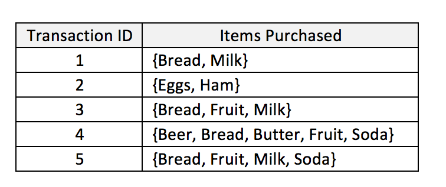

arules_R
========================================================
author: Todd Iverson
date: 11/21/2017
autosize: true


Recall - Association Rules
========================================================

* Example: $\{butter\} \rightarrow \{whole.milk\}$
  * $Support(\textrm{butter and milk}) = \frac{\textrm{Num butter and milk}}{\textrm{Num Total}}$
  * $Support(\textrm{butter}) = \frac{\textrm{Num butter}}{\textrm{Nu
  m Total}}$
  * $Confidence= \frac{Support(\textrm{butter and milk})}{Support(\textrm{butter})}$
  * $Confidence= \frac{Confidence}{Support(\textrm{butter})}$
  
Exercise - Compute the confidence and lift (small example)
========================================================



Arules with R (The long way)
========================================================

* Use `dyplr` to 
  * mutate to compute logical values
  * summarize to compute counts and percents
  
  
Read the data set
========================================================


```r
groceries <- read.csv("Groceries.csv",
                      header = TRUE,
                      sep=",")
head(groceries[, 1:6])
```

```
  frankfurter sausage liver.loaf ham meat finished.products
1           0       0          0   0    0                 0
2           0       0          0   0    0                 0
3           0       0          0   0    0                 0
4           0       0          0   0    0                 0
5           0       0          0   0    0                 0
6           0       0          0   0    0                 0
```

Set Up
========================================================


```r
library(dplyr)
butter_milk <- groceries %>%
                select("butter", "whole.milk")
head(butter_milk)
```

```
  butter whole.milk
1      0          0
2      0          0
3      0          1
4      0          0
5      0          1
6      1          1
```

```r
N <- nrow(groceries)
N
```

```
[1] 9835
```

Compute the Total for Butter
========================================================


```r
total_butter <- butter_milk %>%
  filter(butter == 1) %>%
  summarize(total_butter = sum(butter))
total_butter
```

```
  total_butter
1          545
```

```r
support_butter = total_butter/N
support_butter
```

```
  total_butter
1   0.05541434
```

Compute the Proportion for Butter
========================================================


```r
support_butter <- butter_milk %>%
  filter(butter == 1) %>%
  summarize(support_butter = sum(butter)/N)
support_butter
```

```
  support_butter
1     0.05541434
```

Exercise - Compute the Support of whole.milk
========================================================

* Verify that the Whole Milk column is `whole.milk`
* Compute the support


Solution
========================================================


```r
support_milk <- 
  butter_milk %>%
  mutate(bought_milk = whole.milk == 1) %>%
  summarize(total_milk = sum(bought_milk)/N)
support_milk
```

```
  total_milk
1   0.255516
```

Support for Butter and Milk
========================================================


```r
support_butter_milk <- 
  butter_milk %>%
  mutate(bought_butter_and_milk = (butter == 1 & whole.milk == 1)) %>%
  summarize(total_butter = sum(bought_butter_and_milk)/N)
support_butter_milk
```

```
  total_butter
1   0.02755465
```

Confidence and Lift
========================================================


```r
conf_butter_milk <- support_butter_milk/support_butter
conf_butter_milk
```

```
  total_butter
1    0.4972477
```

```r
lift_butter_milk <- conf_butter_milk/support_milk
lift_butter_milk
```

```
  total_butter
1     1.946053
```

All at once
========================================================


```r
groceries %>%
  mutate(bought_milk = whole.milk == 1,
          bought_butter = butter == 1,
          bought_butter_milk = (butter == 1 & whole.milk == 1)) %>%
          summarize(support_milk = sum(bought_milk)/N,
                    support_butter = sum(bought_butter)/N,
                    support_butter_milk = sum(bought_butter_milk)/N) %>%
          mutate(confidence = support_butter_milk/support_butter) %>%
          mutate(lift = confidence/support_milk)
```

```
  support_milk support_butter support_butter_milk confidence     lift
1     0.255516     0.05541434          0.02755465  0.4972477 1.946053
```

Notes
========================================================

* Must compute values before you use them
  * Compute supports before confidence
  * Compute confidence before lift

Exercise
========================================================

* Compute the confidence and lift for the following rules
  * $\{Cereal\} \rightarrow \{Whole Milk\}$
  * $\{Liquor\} \rightarrow \{Whole Milk\}$
* Try doing this with one `mutate`
* Interpret the values of the lift for each.


Example Data Frame
========================================================


```r
df <- data.frame("a" = c(1,2),
                 "b" = c(3,4),
                 "c" = c(5,6),
                 "d" = c(7,8))
df
```

```
  a b c d
1 1 3 5 7
2 2 4 6 8
```


Stacking Columns with gather
========================================================


```r
library(tidyr)
stacked <- df %>%
  gather(key = "Label",
         value = "Value",
         a, b, c)
stacked
```

```
  d Label Value
1 7     a     1
2 8     a     2
3 7     b     3
4 8     b     4
5 7     c     5
6 8     c     6
```

Stacking All-But-One Column with gather
========================================================


```r
library(tidyr)
stacked <- df %>%
  gather(key = "Label",
         value = "Value",
         -d)
stacked
```

```
  d Label Value
1 7     a     1
2 8     a     2
3 7     b     3
4 8     b     4
5 7     c     5
6 8     c     6
```


Group and Aggregate with group_by
========================================================

```r
stacked %>%
  group_by(Label) %>%
  summarize(mean = mean(Value))
```

```
# A tibble: 3 x 2
  Label  mean
  <chr> <dbl>
1     a   1.5
2     b   3.5
3     c   5.5
```

Group and Aggregate with group_by
========================================================

```r
stacked
```

```
  d Label Value
1 7     a     1
2 8     a     2
3 7     b     3
4 8     b     4
5 7     c     5
6 8     c     6
```
***

```r
stacked %>%
  group_by(Label) %>%
  summarize(mean = mean(Value))
```

```
# A tibble: 3 x 2
  Label  mean
  <chr> <dbl>
1     a   1.5
2     b   3.5
3     c   5.5
```

Computing Many Rules At Once
========================================================

* Stack the LHS into one column
* Group by LHS
* Compute values
  * Support
  * Confidence
  * Lift
  
Step 0 - Read the data and load libraries
========================================================


```r
# Be sure to change the working directory
library(tidyr)
library(dplyr)

groceries <- read.csv("Groceries.csv",
                      header = TRUE,
                      sep=",")
N <- nrow(groceries)
```

Step 1 - Stack all of the other products
========================================================


```r
groceries_stacked <-
  groceries %>%
  gather(key = "Other",
         value = "Purch",
         -whole.milk)
head(groceries_stacked)
```

```
  whole.milk       Other Purch
1          0 frankfurter     0
2          0 frankfurter     0
3          1 frankfurter     0
4          0 frankfurter     0
5          1 frankfurter     0
6          1 frankfurter     0
```


 
Step 2 - Make the logical columns
========================================================


```r
stacked_with_logical <-
  groceries_stacked %>%
  mutate(pur_milk = whole.milk == 1,
         pur_lhs = Purch == 1,
         pur_both = (Purch == 1 & whole.milk == 1)) 
head(stacked_with_logical)
```

```
  whole.milk       Other Purch pur_milk pur_lhs pur_both
1          0 frankfurter     0    FALSE   FALSE    FALSE
2          0 frankfurter     0    FALSE   FALSE    FALSE
3          1 frankfurter     0     TRUE   FALSE    FALSE
4          0 frankfurter     0    FALSE   FALSE    FALSE
5          1 frankfurter     0     TRUE   FALSE    FALSE
6          1 frankfurter     0     TRUE   FALSE    FALSE
```


Step 3 - Compute the support, confidence, and lift for each
========================================================


```r
# Note that we group_by the products to keep them separate.
many_rules <-
stacked_with_logical %>%
  group_by(Other) %>%
  summarize(sup_milk = sum(pur_milk)/N,
            sup_lhs = sum(pur_lhs)/N,
            sup_both = sum(pur_both)/N) %>%
  mutate(conf = sup_both/sup_lhs) %>%
  mutate(lift = conf/sup_milk) %>%
  select(Other, conf, lift)
```

View the results
========================================================


```r
View(many_rules)
```


Automate the process with the arules library
========================================================


```r
install.packages("arules")
library(arules)
```


Columns must be factors
========================================================


```r
groc_factors <-
  groceries %>%
  mutate_if(is.integer, as.factor)
```


  
Make a transaction object
========================================================


```
Error in as(groc_factors, "transactions") : 
  no method or default for coercing "data.frame" to "transactions"
```
