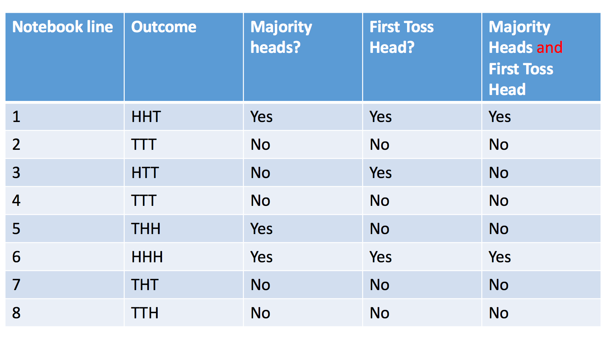
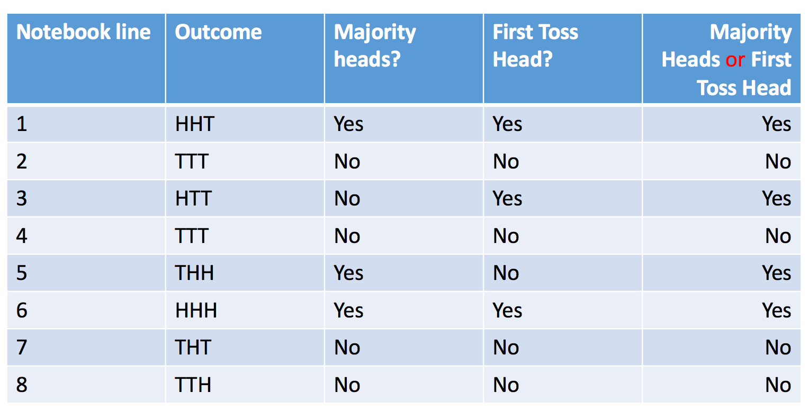
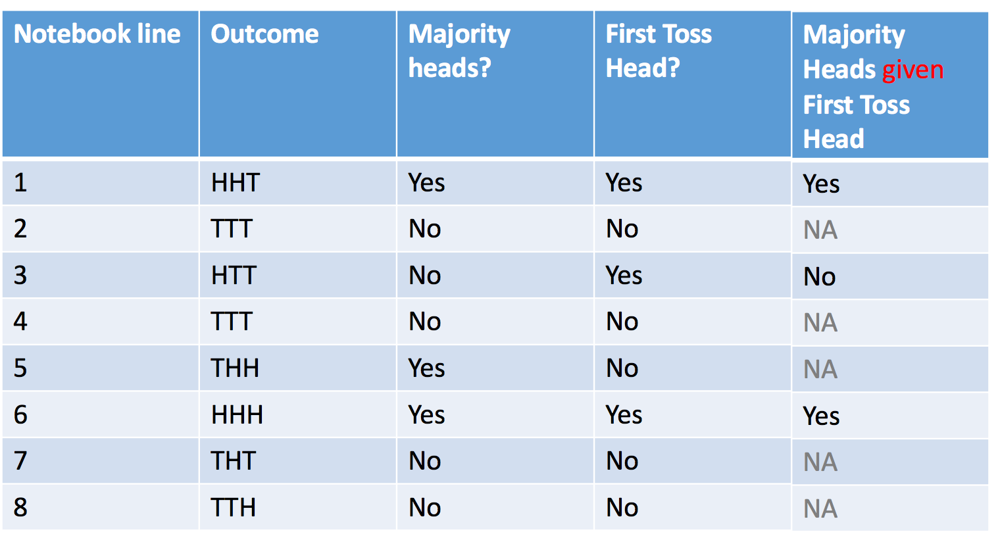

Other Probability Rules
========================================================
author: 
date: 
autosize: true

Old Example in R

Package the whole process in a pipe
========================================================


```r
library(dplyr)
sides = c("H", "T")
notebook <- replicate(100, sample(sides, 3, replace = TRUE)) %>%
              t() %>%
              as.data.frame() %>%
              setNames(c("Toss_1", "Toss_2", "Toss_3"))
              
head(notebook)
```

```
  Toss_1 Toss_2 Toss_3
1      T      H      T
2      T      T      H
3      H      H      T
4      T      T      T
5      H      H      T
6      H      T      H
```

First Toss is a Head
========================================================


```r
notebook <- notebook %>%
              mutate(first_head = (Toss_1 == "H"))
head(notebook)
```

```
  Toss_1 Toss_2 Toss_3 first_head
1      T      H      T      FALSE
2      T      T      H      FALSE
3      H      H      T       TRUE
4      T      T      T      FALSE
5      H      H      T       TRUE
6      H      T      H       TRUE
```

Majority of Tosses are Heads
========================================================


```r
notebook <- notebook %>%
              mutate(num_heads = (Toss_1 == "H") +
                       (Toss_2 == "H") +
                       (Toss_3 == "H")) %>% 
              mutate(majority_heads = num_heads >= 2)
head(notebook)
```

```
  Toss_1 Toss_2 Toss_3 first_head num_heads majority_heads
1      T      H      T      FALSE         1          FALSE
2      T      T      H      FALSE         1          FALSE
3      H      H      T       TRUE         2           TRUE
4      T      T      T      FALSE         0          FALSE
5      H      H      T       TRUE         2           TRUE
6      H      T      H       TRUE         2           TRUE
```


Probability Rules
========================================================

- Complements: $P(A^C) = 1 - P(A)$
- Empty Set: $P(\emptyset) = 0$
- Subsets: $A \subseteq B \Rightarrow P(A) \le P(B)$
- Unions: $P(A\cup B) = P(A) + P(B) - P(A\cap B)$
- Union + Mutually Exclusive: $P(A\cup B) = P(A) + P(B)$

Notebook Context and P(A and B)
========================================================




Notebook Context and P(A and B) in R
========================================================


```r
notebook_and <- notebook %>%
              mutate(first_head & majority_heads)
head(notebook_and)
```

```
  Toss_1 Toss_2 Toss_3 first_head num_heads majority_heads
1      T      H      T      FALSE         1          FALSE
2      T      T      H      FALSE         1          FALSE
3      H      H      T       TRUE         2           TRUE
4      T      T      T      FALSE         0          FALSE
5      H      H      T       TRUE         2           TRUE
6      H      T      H       TRUE         2           TRUE
  first_head & majority_heads
1                       FALSE
2                       FALSE
3                        TRUE
4                       FALSE
5                        TRUE
6                        TRUE
```

Notebook Context and P(A or B)
========================================================




Notebook Context and P(A or B) in R
========================================================


```r
notebook_or <- notebook %>%
              mutate(first_head | majority_heads)
head(notebook_or)
```

```
  Toss_1 Toss_2 Toss_3 first_head num_heads majority_heads
1      T      H      T      FALSE         1          FALSE
2      T      T      H      FALSE         1          FALSE
3      H      H      T       TRUE         2           TRUE
4      T      T      T      FALSE         0          FALSE
5      H      H      T       TRUE         2           TRUE
6      H      T      H       TRUE         2           TRUE
  first_head | majority_heads
1                       FALSE
2                       FALSE
3                        TRUE
4                       FALSE
5                        TRUE
6                        TRUE
```

Notebook Context and P(A | B) or P(A given B)
========================================================




Notebook Context and P(A | B) in R
========================================================


```r
notebook_cond <- notebook %>%
              filter(first_head == TRUE)
head(notebook_cond)
```

```
  Toss_1 Toss_2 Toss_3 first_head num_heads majority_heads
1      H      H      T       TRUE         2           TRUE
2      H      H      T       TRUE         2           TRUE
3      H      T      H       TRUE         2           TRUE
4      H      H      T       TRUE         2           TRUE
5      H      T      H       TRUE         2           TRUE
6      H      H      H       TRUE         3           TRUE
```

In Summary
========================================================
- $P(A)$ means the long-run fraction of lines in the notebook in which the A column says Yes/TRUE
- $P(A \textrm{ or } B)$ means the long-run fraction of lines in the notebook in which the A-or-B column says Yes/TRUE.
- $P(A \textrm{ and } B)$ means the long-run fraction of lines in the notebook in which the A-and-B column says Yes/TRUE.
- $P(A|B)$ means the long-run fraction of lines in the notebook in which the A|B column says Yes/TRUE among the lines which do NOT say NA(filtered out).

Exercises
========================================================

Suppose that we have an urn with 3 blue chips and 4 red chips.  We draw two chips without replacement.

1. Use a simulation to approximate the answer to each of the following questions.
  1. What is the probability that the second chip is red?
  2. What is the probability that the first chip is red and the second chip is blue?
  3. Given that the first chip is red, what is the probability that the second chip is blue?
  4. Given that the second chip is red, what is the probability that the first chip is blue?
2. Create a probability tree and use it to answer each the probability questions given in part 1 (part 4 is a **bonus problem**).  If you work these out on paper, take a picture of your result and insert that picture in a Word document.
