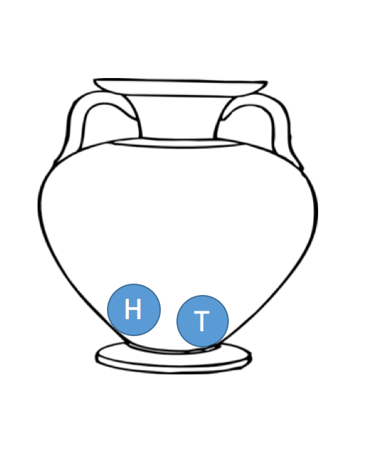
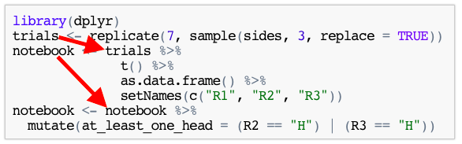

Simulating the Notebook Context
========================================================
author: Todd Iverson
date: 
autosize: true

The Notebook Context
========================================================

***
- Useful way to imagine an experiment
- Each row represents 1 trial
- First column is an outcome
- Subsequent columns are TRUE/FALSE questions

Two types of experiments
========================================================

- Most experiments can be thoughts of as sampling problems
- There are two types of sampling
  - with replacement
  - without replacement 
- Types of experiments
  - **simple experiments** have sample size 1
  - **compound experiments** have sample size $n > 1$

Example: Coin Tosses
========================================================

***
- Flipping a fair coin
- Sample from a container with `"H"` and `"T"`
- Questions
  - with or without replacement?
  - How would you simulate a coin that comes up heads 60% of the time?


Today's Goals
========================================================

- Simulate simple and compound events with `sample`
- Mimic the notebook context with a data frame
- Understand the *shape* of simulation code for
  - simple experiments
  - compound experiments

Using `sample` for simple experiments
========================================================


```r
# Make the "container" (char vector)
sides = c("H", "T")
```

```r
# Use sample to simulate the experiment
sample(sides, 1, replace = TRUE)
```

```
[1] "H"
```

```r
sample(sides, 1, replace = TRUE)
```

```
[1] "H"
```

Using `sample` for compound experiments
========================================================


```r
# Use sample to simulate the experiment
sample(sides, 3, replace = TRUE)
```

```
[1] "H" "H" "H"
```

```r
sample(sides, 3, replace = TRUE)
```

```
[1] "T" "H" "T"
```

Use `replicate` to repeat the experiment
========================================================

- `replicate` repeats an expression $n$ times
- Syntax: `replicate(n, expr)`
- Useful for simulations
  - Make a function for 1 trials
  - Use replicate + function call for many trials
  
Replicate in action
========================================================


```r
trials <- replicate(7, sample(sides, 3, replace = TRUE))
trials
```

```
     [,1] [,2] [,3] [,4] [,5] [,6] [,7]
[1,] "H"  "H"  "H"  "H"  "T"  "H"  "T" 
[2,] "T"  "T"  "T"  "T"  "T"  "T"  "H" 
[3,] "H"  "T"  "H"  "H"  "H"  "H"  "H" 
```

Transpose with `t` to make the data tall
========================================================

- `t` is transpose
- switches rows and columns


```r
t(trials)
```

```
     [,1] [,2] [,3]
[1,] "H"  "T"  "H" 
[2,] "H"  "T"  "T" 
[3,] "H"  "T"  "H" 
[4,] "H"  "T"  "H" 
[5,] "T"  "T"  "H" 
[6,] "H"  "T"  "H" 
[7,] "T"  "H"  "H" 
```

Package the outcomes in a data frame
========================================================


```r
library(dplyr)
notebook <- trials %>% 
              t() %>% 
              as.data.frame() %>% 
              setNames(c("R1", 
                         "R2", 
                         "R3"))
notebook
```

```
  R1 R2 R3
1  H  T  H
2  H  T  T
3  H  T  H
4  H  T  H
5  T  T  H
6  H  T  H
7  T  H  H
```

Using `mutate` to asks questions about the trials
========================================================
- **Question 1:** Was the first roll a head?


```r
library(dplyr)
notebook <- notebook %>% 
              mutate(first_head = (R1 == "H"))
notebook
```

```
  R1 R2 R3 first_head
1  H  T  H       TRUE
2  H  T  T       TRUE
3  H  T  H       TRUE
4  H  T  H       TRUE
5  T  T  H      FALSE
6  H  T  H       TRUE
7  T  H  H      FALSE
```

Using `mutate` to asks questions about the trials
========================================================
- **Question 2:** Was there at least one head in the last two rolls
- **Note:** The symbol `|` and `&` are *or* and *and*, respectively


```r
library(dplyr)
notebook <- notebook %>% 
  mutate(at_least_one_head = (R2 == "H") | (R3 == "H"))
notebook
```

```
  R1 R2 R3 first_head at_least_one_head
1  H  T  H       TRUE              TRUE
2  H  T  T       TRUE             FALSE
3  H  T  H       TRUE              TRUE
4  H  T  H       TRUE              TRUE
5  T  T  H      FALSE              TRUE
6  H  T  H       TRUE              TRUE
7  T  H  H      FALSE              TRUE
```

Separate (Imperative) Code
========================================================

```r
library(dplyr)
trials <- replicate(7, sample(sides, 3, replace = TRUE))
notebook <- trials %>% 
              t() %>% 
              as.data.frame() %>% 
              setNames(c("R1", "R2", "R3"))
notebook <- notebook %>% 
  mutate(at_least_one_head = (R2 == "H") | (R3 == "H"))
```

Noticing the pipe pattern
========================================================



- The **imperative pipe pattern**: Anytime one pipe starts with the output of the last.
- We can *compose* the imperative pipe pattern into one pipe

Package the whole process in a pipe
========================================================


```r
notebook <- 
  replicate(100, sample(sides, 3, replace = TRUE)) %>%
  t() %>%
  as.data.frame() %>%
  setNames(c("R1", "R2", "R3")) %>%
  mutate(first_head = (R1 == "H")) %>%
  mutate(at_least_one_head = (R2 == "H") | (R3 == "H"))
notebook
```

```
    R1 R2 R3 first_head at_least_one_head
1    T  H  T      FALSE              TRUE
2    H  T  T       TRUE             FALSE
3    T  T  T      FALSE             FALSE
4    H  T  T       TRUE             FALSE
5    H  T  T       TRUE             FALSE
6    T  H  T      FALSE              TRUE
7    T  T  H      FALSE              TRUE
8    H  T  T       TRUE             FALSE
9    H  H  T       TRUE              TRUE
10   H  H  T       TRUE              TRUE
11   H  H  H       TRUE              TRUE
12   H  H  H       TRUE              TRUE
13   H  H  T       TRUE              TRUE
14   T  T  T      FALSE             FALSE
15   T  T  T      FALSE             FALSE
16   T  T  T      FALSE             FALSE
17   H  T  H       TRUE              TRUE
18   H  T  H       TRUE              TRUE
19   T  T  H      FALSE              TRUE
20   T  T  H      FALSE              TRUE
21   T  H  T      FALSE              TRUE
22   T  H  T      FALSE              TRUE
23   H  H  H       TRUE              TRUE
24   H  H  H       TRUE              TRUE
25   T  T  H      FALSE              TRUE
26   H  H  T       TRUE              TRUE
27   T  H  T      FALSE              TRUE
28   T  H  H      FALSE              TRUE
29   T  H  H      FALSE              TRUE
30   T  H  T      FALSE              TRUE
31   T  T  T      FALSE             FALSE
32   H  T  H       TRUE              TRUE
33   T  H  H      FALSE              TRUE
34   T  T  H      FALSE              TRUE
35   T  H  T      FALSE              TRUE
36   H  T  H       TRUE              TRUE
37   H  T  T       TRUE             FALSE
38   H  H  H       TRUE              TRUE
39   H  T  T       TRUE             FALSE
40   T  T  H      FALSE              TRUE
41   H  H  H       TRUE              TRUE
42   H  H  T       TRUE              TRUE
43   T  T  T      FALSE             FALSE
44   H  H  H       TRUE              TRUE
45   T  H  H      FALSE              TRUE
46   H  H  H       TRUE              TRUE
47   T  H  T      FALSE              TRUE
48   H  T  H       TRUE              TRUE
49   T  T  T      FALSE             FALSE
50   T  T  T      FALSE             FALSE
51   T  H  H      FALSE              TRUE
52   T  H  T      FALSE              TRUE
53   T  T  H      FALSE              TRUE
54   T  H  H      FALSE              TRUE
55   T  H  T      FALSE              TRUE
56   T  T  H      FALSE              TRUE
57   H  T  H       TRUE              TRUE
58   T  T  H      FALSE              TRUE
59   H  T  T       TRUE             FALSE
60   T  T  T      FALSE             FALSE
61   T  H  H      FALSE              TRUE
62   H  H  H       TRUE              TRUE
63   H  H  H       TRUE              TRUE
64   H  T  T       TRUE             FALSE
65   T  T  T      FALSE             FALSE
66   H  T  T       TRUE             FALSE
67   H  T  T       TRUE             FALSE
68   T  H  H      FALSE              TRUE
69   H  T  T       TRUE             FALSE
70   H  T  H       TRUE              TRUE
71   T  T  H      FALSE              TRUE
72   H  T  H       TRUE              TRUE
73   H  T  H       TRUE              TRUE
74   T  T  T      FALSE             FALSE
75   H  H  T       TRUE              TRUE
76   T  T  T      FALSE             FALSE
77   T  H  H      FALSE              TRUE
78   T  T  T      FALSE             FALSE
79   H  H  T       TRUE              TRUE
80   H  H  T       TRUE              TRUE
81   H  H  T       TRUE              TRUE
82   H  T  H       TRUE              TRUE
83   H  T  T       TRUE             FALSE
84   T  T  T      FALSE             FALSE
85   T  H  H      FALSE              TRUE
86   H  H  H       TRUE              TRUE
87   H  T  T       TRUE             FALSE
88   T  H  H      FALSE              TRUE
89   H  H  H       TRUE              TRUE
90   T  H  H      FALSE              TRUE
91   H  T  H       TRUE              TRUE
92   H  H  T       TRUE              TRUE
93   T  T  H      FALSE              TRUE
94   T  H  T      FALSE              TRUE
95   T  T  H      FALSE              TRUE
96   H  T  T       TRUE             FALSE
97   T  T  H      FALSE              TRUE
98   H  T  H       TRUE              TRUE
99   H  H  T       TRUE              TRUE
100  T  T  H      FALSE              TRUE
```

The mean of a logical vector is the number of TRUE entries
========================================================

- recall that `TRUE` and `FALSE` promotes to 0 and 1


```r
mean(c(TRUE, FALSE, TRUE, TRUE))
```

```
[1] 0.75
```

Estimate the probability with `summarize` and `mean`
========================================================


```r
notebook %>%
  summarize("P(first is head)" = mean(first_head), 
            "P(at least one head)" = mean(at_least_one_head))
```

```
  P(first is head) P(at least one head)
1             0.49                 0.72
```

Exercises
========================================================
  
1. Create a data frame for the experiment "Roll 2 fair 6-sided dice"
  1. Sample from what container?
2. Create logical columns for each of the following
  1. The first roll is larger than 4
  2. The sum is larger than 7
3. Estimate the probability of each of the events given above

Simulating a simple experiment with built-in functions
========================================================

- R can simulate many distributions
  - `rnorm(N, mu, sigma)` for normal data,
  - `rbinom(N, n, p)` for binomial data, etc.
- There give one outcome in a vector
  - Simple experiment
  
These functions return vectors
========================================================


```r
trials <- rnorm(5, 2, 3)
trials
```

```
[1] 5.172790 3.959790 2.147835 3.308878 6.383257
```

```r
is.vector(trials)
```

```
[1] TRUE
```

Vectors don't need the transpose
========================================================


```r
notebook <-
  rnorm(5, 2, 3) %>%
  # t() %>% # Skip the transpose
  as.data.frame %>%
  setNames(c("X"))
notebook
```

```
          X
1  8.427333
2  2.080942
3 -1.202907
4 -3.582241
5  4.249950
```

Experiments using R "r" functions
========================================================


```r
notebook <-
  rnorm(100, 2, 3) %>%
  as.data.frame() %>%
  setNames(c("X"))
```

- pass directly into `as.data.frame`
- skip `t()`

Simple using replicate and sample
========================================================


```r
space <- c(1,2,3,4)
notebook <-
  replicate(100, 
            sample(1, 
                   space, 
                   replace = TRUE)) %>%
  as.data.frame()
```
- `sample` with $n = 1$
- pass directly into `as.data.frame`
- skip `t()`

Compound experiments using `replicate` and `sample`
========================================================


```r
space <- c(1,2,3,4)
notebook <-
  replicate(100, 
            sample(2, 
                   space, 
                   replace = TRUE)) %>%
  t() %>%
  as.data.frame()
```
- `sample` with $n > 1$
- `replicate` $\rightarrow$ `t()` $\rightarrow$ `as.data.frame`

