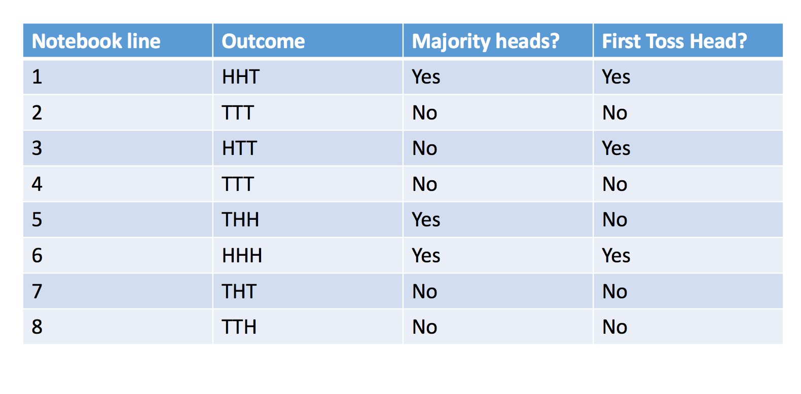
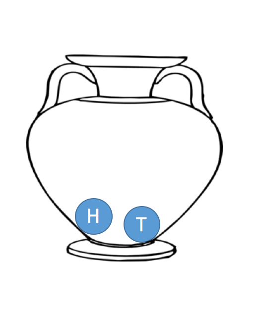

---
Simulating the Notebook Context
========================================================
author: Todd Iverson
date: 
autosize: true

The Notebook Context
========================================================

***
- Useful way to imagine an experiment
- Each row represents 1 trial
- First column is an outcome
- Subsequent columns are TRUE/FALSE questions

Two types of experiments
========================================================

- Most experiments can be thoughts of as sampling problems
- There are two types of sampling
  - with replacement
  - without replacement 
- Types of experiments
  - **simple experiments** have sample size 1
  - **compound experiments** have sample size $n > 1$

Example: Coin Tosses
========================================================

***
- Flipping a fair coin
- Sample from a container with `"H"` and `"T"`
- Questions
  - with or without replacement?
  - How would you simulate a coin that comes up heads 60% of the time?


Today's Goals
========================================================

- Simulate simple and compound events with `sample`
- Combine compound outcomes into one string with `str_c`
- Mimic the notebook context with a data frame

Using `sample` for simple experiments
========================================================

```{r}
# Make the "container" (char vector)
sides = c("H", "T")
```
```{r}
# Use sample to simulate the experiment
sample(sides, 1, replace = TRUE)
sample(sides, 1, replace = TRUE)
```

Using `sample` for compound experiments
========================================================

```{r}
# Use sample to simulate the experiment
sample(sides, 3, replace = TRUE)
sample(sides, 3, replace = TRUE)
```

<!-- Combine the outcomes into one string with `str_c` -->
<!-- ======================================================== -->
<!-- - Converting 1 string is useful -->
<!--   - Use string functions with `mutate` -->
<!--   - Much easier to answer questions -->

<!-- Example -->
<!-- ======================================================== -->
<!-- left: 40% -->
<!-- ```{r} -->
<!-- library(stringr) -->
<!-- str_c(c("A", "b", "C"), collapse = ",") -->
<!-- ``` -->
<!-- ```{r} -->
<!-- sides %>% sample(3, replace = TRUE) %>% str_c(collapse = "") -->
<!-- str_c(sample(sides, 3, replace = TRUE), collapse = "") -->
<!-- ``` -->

<!-- Package this as a function - Step 1 -->
<!-- ======================================================== -->

<!-- ```{r} -->
<!-- space <- sides -->
<!-- n <- 3 -->
<!-- replace <- TRUE -->
<!-- space %>%  -->
<!--   sample(n, replace = replace) %>%  -->
<!--   str_c(collapse = "") -->
<!-- ``` -->

<!-- - Change values to variables -->
<!-- - Make the names generic -->

<!-- Package this as a function - Step 2 -->
<!-- ======================================================== -->

<!-- ```{r} -->
<!-- outcomes <- function(space, n, replace = TRUE) { -->
<!--   space %>%  -->
<!--     sample(n, replace = replace) %>%  -->
<!--     str_c(collapse = "") -->
<!-- } -->
<!-- outcomes(sides, 3) -->
<!-- ``` -->

<!-- - Wrap in a function -->
<!-- - Execute with a function call -->

Use `replicate` to repeat the experiment
========================================================

- `replicate` repeats an expression $n$ times
- Syntax: `replicate(n, expr)`
- Useful for simulations
  - Make a function for 1 trials
  - Use replicate + function call for many trials
  
Replicate in action
========================================================

```{r}
trials <- replicate(7, sample(sides, 3, replace = TRUE))
trials
```

Transpose with `t` to make the data tall
========================================================

- `t` is transpose
- switches rows and columns

```{r}
t(trials)
```

Package the outcomes in a data frame
========================================================

```{r}
library(dplyr)
notebook <- trials %>% 
              t() %>% 
              as.data.frame() %>% 
              setNames(c("Roll_1", "Roll_2", "Roll_3"))
notebook
```

Using `mutate` to asks questions about the trials
========================================================
- **Question 1:** Was the first roll a head?

```{r}
library(dplyr)
notebook <- notebook %>% 
              mutate(first_head = (Roll_1 == "H"))
notebook
```

Using `mutate` to asks questions about the trials
========================================================
- **Question 2:** Was there at least one head in the last two rolls
- **Note:** The symbol `|` and `&` are *or* and *and*, respectively

```{r}
library(dplyr)
notebook <- notebook %>% 
  mutate(at_least_one_head = (Roll_2 == "H") | (Roll_3 == "H"))
notebook
```

Package the whole process in a pipe
========================================================

```{r}
notebook <- replicate(100, sample(sides, 3, replace = TRUE)) %>%
              t() %>%
              as.data.frame() %>%
              setNames(c("Roll_1", "Roll_2", "Roll_3")) %>%
              mutate(first_head = (Roll_1 == "H")) %>%
              mutate(at_least_one_head = (Roll_2 == "H") | (Roll_3 == "H"))
notebook
```

The `mean` of a logical vector is the number of `TRUE` entries
========================================================

- recall that `TRUE` and `FALSE` promotes to 0 and 1

```{r}
mean(c(TRUE, FALSE, TRUE, TRUE))
```

Estimate the probability with `summarize` and `mean`
========================================================

```{r}
notebook %>%
  summarize("P(first is head)" = mean(first_head), 
            "P(at least one head)" = mean(at_least_one_head))
```

Exercises
========================================================
  
1. Create a data frame for the experiment "Roll 2 fair 6-sided dice"
2. Create logical columns for each of the following
  1. The first roll is larger than 4
  2. The sum is larger than 7
3. Estimate the probability of each of the events given above
  
